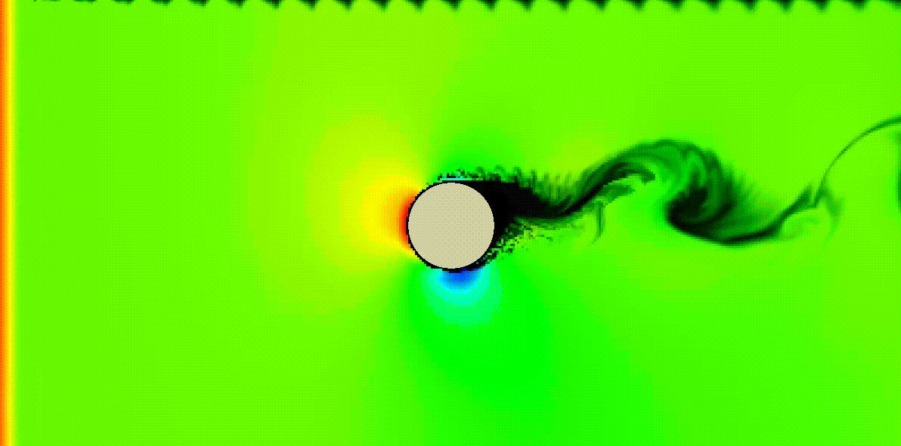

# simhub

## About `simhub`

`simhub` is a simple simulation program built in C.


*simulating the Magnus effect for a spinning 2D ball in a wind tunnel*

## Creating a Simulation

### Setting up the necessary local environment

To create a simulation, first clone this repository into your local machine:

```shell
git clone https://github.com/molee1354/simhub.git
```

Change the current directory into the `simhub` directory that was just created:

```shell
cd ./simhub
```

Before any simulation is created, the necessary Python virtual environment and the bash helper functions and commands must be loaded into the current shell session:

```shell
. ./set-env
```

It is important that this command takes this exact form as this loads the helper functions and the Python virtual environment into the *current* working shell and not as a child process.

If the environment is properly loaded, the terminal will display a message that displays the paths to the current Python interpreter and the Python package manager. It should look something like this:

```shell
Set Python interpreter to 
[/**/.env/pyvenv-3.XX/bin/python3]
Set Python Pip to 
[/**/.env/pyvenv-3.XX/bin/pip3]
```

where the "XX" in `pyvenv-3.XX` should be the version number of the Python interpreter found on your machine.

### Loading a simulation

With the virtual environment and the bash helper functions set up, simulations are now ready to be loaded. To load a simulation, run the `sim` command followed by the desired simulation name. For example, this is how the [Game of Life simulation](https://en.wikipedia.org/wiki/Conway%27s_Game_of_Life) would be called:

```shell
sim call gameoflife
```

The above command will load the simulation with modifiable initial parameters. You should be able to see that within the current  directory, there is a new `./simulation` directory within which are the necessary files and functions for computation. Simulation parameters can be changed in the `./simulation/sim.input` file. You can also directly interact with the `./simulation/src/sim.input` file which is what the `./simulation/sim.input` file is linked to.

Call names for the simulations are simply the directory in which the `Makefile` for the simulation lives, all in lower-case and separated by dashes instead of forward slashes. So from the above command, we can see that the `Makefile` for the Game of Life simulation lives in the `./source/GameOfLife` directory.

### Simulation structure

Apart from the utility libraries, most of the simulations will hold the following structure:

```shell
./simulation
    | Makefile
    | bin/
    | dumps/
    | obj/
    | src/
    | require
    | rules.h
    | sim.input
```

#### `Makefile`

A simple makefile to build and interact with the simulation in various ways. This is also what all the `sim` commands wrap around. You can directly interact with this makefile in the `./simulation` directory if you wish to do so.

#### `bin/` and `obj/`

The directory where the compiled binaries and object files will be set by default.

#### `src/`

The directory where all the `*.c` and `*.h` source files exist. You can modify them directly if there is a need to change the overall behavior of the simulation. The file names will be "mangled" to prevent any file name collisions.

#### `dumps/`

The directory where the data files will be saved. The data files will usually have `dump.*` format to their name.

#### `require`

The file that contains the dependencies for the current simulation. All the necessary dependencies will be put into the `src/` directory with their names "mangled".

#### `rules.h`

A simple file that acts as a switch for name mangling. Modifying it may result in the simulation not being able to compile.

#### `sim.input`

The header file that contains the default parameters for the simulation. This file is a hard link to the file with the same name in the `src/` directory. You can either modify this file or the one in the `src/` directory to change the input parameters of the simulation.

### Running the simulation

To compile and run the simulation, simply run the `sim run` command in the terminal:

```shell
sim run
```

This command compiles the necessary files and runs the simulation after the compilation is done.

To simply compile the simulation without running it, use the `sim make` or `sim build` command.

Depending on the type of simulation, output data computed from the simulation will be saved in a `dump.out` file or a `dumps/` directory if there are several data files. The name of this file can be modified in the `sim.input` file as desired, but is generally not advised as other modules may be looking for `dump.*` type files.

### Modifying the simulation

Modifications to the simulation parameters can be made by changing the `./simulation/sim.input` file. For any code-related modifications, you can simply make edits to the files in the `./simulation/src` directory.

### Deleting / Re-running the simulation

#### Re-running

To re-run the simulation after modifying some of its parameters, you must recompile the simulation (this is indeed a roundabout way to get to things, which I intend on fixing in the future. But for now, the simulations are quite tiny, so it should work). To recompile, simply run:

```shell
sim rrun
```

By default the `sim rrun` command will chain the `sim make clean` and the `sim run` command so that you can recompile the simulation with the modified parameters.

#### Deleting

To simply delete the simulation, run the `sim clean` command in the terminal (not to be confused with `sim make clean`).

```shell
sim clean
```

This will simply delete the `./simulation` directory in which the current simulation is called in. This command will delete any modifications you made in the simulations directory, so be especially mindful of that if you have any groundbreaking modifications underway.

### Visualization

Simulations that support Python-based data visualizations have a `./vis/` module within the simulation directory. To visualize the simulation, either run the

```shell
sim plot
```

command to plot the simulation, and

```shell
sim anim
```

to visualize the simulation.
